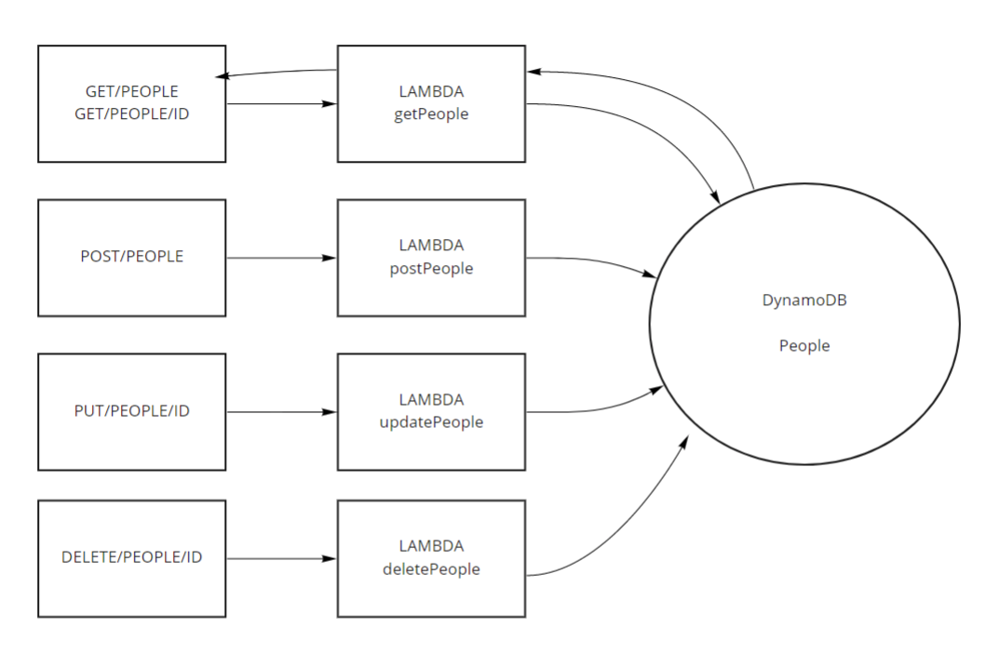

# Serverless API

Author: Katy Roffe

API Link: [url](https://7rr148n24h.execute-api.us-west-2.amazonaws.com/people/)

## About

Create a single resource REST API using a domain model of your choosing, constructed using AWS Cloud Services

## Routes

- POST
  - /people
    - inserts a record into the database
    - requires a body with a name and age
    - returns a JSON
- GET
  - /people
    - returns all objects in the database
  - /people/ID
    - requires an assigned id
    - returns a single object
- PUT
  - /people/##
    - updates a record in the database by its id
    - requires id
    - returns a success message / empty object
- DELETE
  - /people/##
    - removes the matching record from the database
    - requires id
    - returns success message / empty object

## UML

